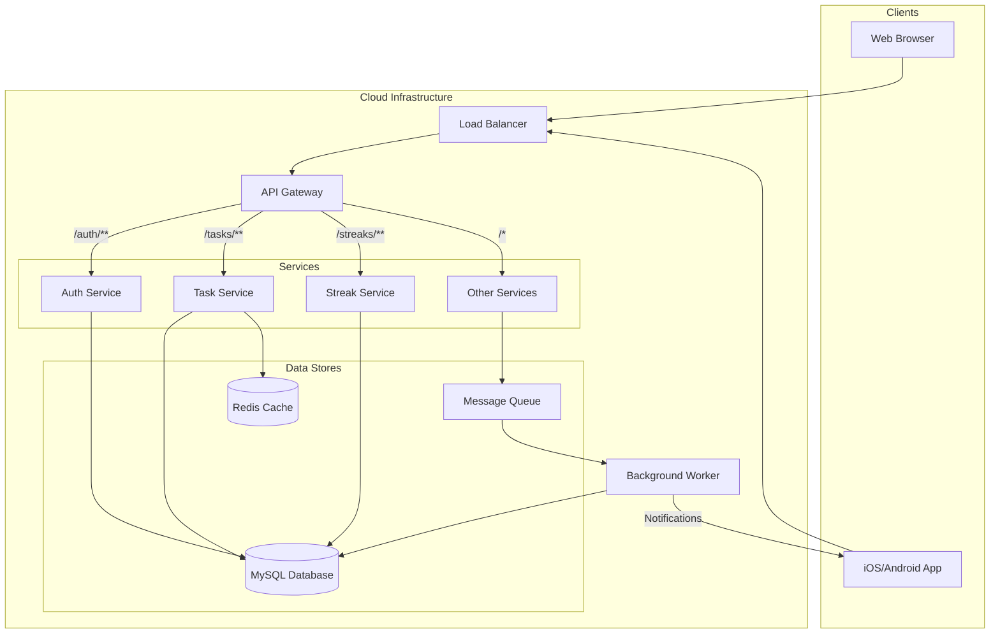

# **AGENDOS - Product Requirements Document (PRD) v1.0**

| **Status**     | **In Development**                               |
| :------------- | :----------------------------------------------- |
| **Version**    | **1.0**                                          |
| **Created**    | **Dec 04, 2025**                                 |
| **Lead**       | **Product, Architecture, UX**                    |
| **Contact**    | **[Project Lead Email/Contact]**                 |
| **Stakeholders** | **Engineering, Design, Product, QA, Marketing**  |

---

## **1. Product Overview**

**AGENDOS** is an intelligent productivity system designed to transform daily tasks into meaningful accomplishments. It moves beyond simple to-do lists by integrating capacity planning, momentum-building streaks, and wellness principles into a unified, frictionless experience. Our core philosophy is built on **clarity, focus, wellness, and achievement**, empowering users to not only plan their day but execute with purpose.

AGENDOS is positioned as a premium life-management tool for ambitious individuals who want to optimize their performance, build lasting habits, and achieve long-term goals without burning out.

---

## **2. Problem Statement**

Modern professionals and ambitious individuals struggle with two primary productivity failures:
1.  **Over-Commitment & Burnout:** Traditional task managers allow users to create endless lists without regard for their actual daily capacity (time and energy), leading to overwhelm, anxiety, and incomplete work.
2.  **Loss of Momentum:** Long-term goals fail when daily consistency is broken. Most tools don't provide the motivational feedback loops necessary to maintain momentum through challenging periods.

As a result, users feel busy but not productive, and their most important goals are perpetually pushed to "tomorrow." AGENDOS is being built to solve this by providing a smarter, more sustainable framework for execution.

---

## **3. Product Goals**

| Goal ID | Goal Description                               | Key Result (Metric)                               | Target (V1)     |
| :------ | :--------------------------------------------- | :------------------------------------------------ | :-------------- |
| G-01    | **Drive Daily Engagement**                     | Increase the ratio of Daily Active Users (DAU) to Monthly Active Users (MAU). | DAU/MAU > 40%   |
| G-02    | **Validate Core Value Prop**                   | Achieve a high rate of task completion and streak maintenance among active users. | > 70% of scheduled tasks completed |
| G-03    | **Establish a Foundation for Growth**          | Successfully launch a stable, scalable V1 on Web, iOS, and Android. | 100% of V1 features deployed |
| G-04    | **Achieve High User Satisfaction**             | Attain a high Net Promoter Score (NPS) and positive app store ratings. | NPS > 50; App Rating > 4.7 |

---

## **4. Target Users**

1.  **Ambitious Professionals:** Knowledge workers, freelancers, and entrepreneurs managing multiple projects and deadlines who need to optimize their deep work and personal time.
2.  **University Students & Researchers:** Individuals with long-term study goals, research projects, and heavy coursework who need to build consistent study habits.
3.  **Habit-Builders & Self-Improvers:** Users focused on personal development, fitness, learning new skills, or breaking bad habits who thrive on gamification and progress tracking.
4.  **The "Organized-But-Overwhelmed":** People who are good at planning but consistently overestimate their capacity, leading to stress and the need for a more realistic system.

---

## **5. User Personas**

### **Persona 1: Ambitious Alex (Professional)**
-   **Role:** Senior Software Engineer, 32
-   **Goals:** Ship a major feature at work, train for a half-marathon, read 2 books a month.
-   **Frustrations:** Feels like he's "always on" but not making real progress on his biggest goals. His calendar is full, but his task list is a source of anxiety.
-   **Needs AGENDOS for:** Capacity planning (`Effort Budget`), separating deep work tasks from shallow ones (`Focus Mode`), and building a consistent running habit (`Habits & Streaks`).

### **Persona 2: Student Sarah (Academic)**
-   **Role:** PhD Candidate, 24
-   **Goals:** Finish her dissertation, publish a paper, learn German.
-   **Frustrations:** Procrastinates on large, unstructured tasks like "write chapter 2." Feels overwhelmed by the lack of clear, daily milestones.
-   **Needs AGENDOS for:** Breaking down huge goals into manageable daily tasks (`Goals` & `Projects`), maintaining a daily writing habit (`Streaks`), and seeing her progress over time (`Analytics`).

---

## **6. User Journey Flow**

```mermaid
graph TD
    subgraph Onboarding
        A[Start: Download App] --> B{Account Creation};
        B --> C[Set Profile & Preferences];
        C --> D[Introduce Effort Budget];
        D --> E[Create First Task/Goal];
        E --> F[Onboarding Complete];
    end

    subgraph Daily Loop
        G[Open App: Morning] --> H[Review Dashboard: See Day's Plan];
        H --> I{Execute Tasks};
        I --> J["Use Focus Mode (Optional)"];
        J --> K["Complete Streak Task"];
        I --> L[Log Wellness Metric (e.g., Mood)];
        M{End of Day} --> N[Evening Review];
        N --> O[Plan Tomorrow];
        O --> G;
    end
    
    F --> G;
```

---

## **7. Core Features Overview**

| Module                     | V1 Scope (Core Foundation)                                      | V2+ (Expansion)                                         |
| :------------------------- | :-------------------------------------------------------------- | :------------------------------------------------------ |
| **Authentication**         | **Implemented** (Email/Password, JWT)                             | Social Logins (Google, Apple), MFA                      |
| **Users & Settings**       | **Foundation** (Profile, `maximum_daily_capacity`)              | Personalization, Themes, Connected Accounts             |
| **Tasks**                  | **Foundation** (CRUD, schedule, effort, energy)                   | Recurring Tasks, Sub-tasks, File Attachments            |
| **Projects**               | **Foundation** (Group tasks by a project)                         | Project templates, progress meters                      |
| **Habits & Streaks**       | **Foundation** (`streak_chains` table, manual tracking)         | Automated streak logic, Health Indicator, Analytics     |
| **Goals**                  | **Planned** (Define long-term goals, link projects/tasks)       | Goal progress visualization, AI-generated milestones    |
| **Reminders**              | **Planned** (Simple, time-based notifications)                    | Smart/adaptive reminders, location-based               |
| **Calendar View**          | **Planned** (Basic view of scheduled tasks)                       | 2-way sync with Google/Outlook Calendar                 |
| **Productivity Analytics** | **Planned** (Dashboard with basic stats: tasks done, streaks) | Trend analysis, burnout risk reports                  |
| **Focus Mode**             | **Planned** (Simple timer linked to a task)                     | Distraction blocking (apps/sites), ambient sounds     |
| **Wellness Tracking**      | **Planned** (Manual logging of mood, sleep)                     | Correlation analysis (e.g., sleep vs. productivity)   |
| **AI Assistance**          | **NOT IN V1**                                                   | Smart scheduling, goal decomposition, task suggestions  |
| **Onboarding**             | **Planned** (Simple multi-step setup flow)                      | Interactive, personalized onboarding tour             |
| **Sync & Mobile**          | **V1 Requirement** (Backend must support mobile clients)          | Offline mode, native widgets                          |

---

## **8. Functional Requirements per Module**

### **FR-M1: Tasks Module**
-   **FR-1.1:** Users MUST be able to Create, Read, Update, and Delete (CRUD) tasks.
-   **FR-1.2:** A task MUST have: `title`, `description` (optional), `project_sn` (optional), `scheduled_date` (optional), `effort_estimate_minutes`, `energy_required` ('low', 'medium', 'high').
-   **FR-1.3:** The system MUST prevent a user from scheduling tasks that exceed their `maximum_daily_capacity`.

### **FR-M2: Projects Module**
-   **FR-2.1:** Users MUST be able to CRUD projects.
-   **FR-2.2:** A project MUST have a `name` and belong to a user.
-   **FR-2.3:** Users MUST be able to assign a task to a project.
-   **FR-2.4:** Deleting a project MUST either delete all associated tasks or un-assign them.

### **FR-M3: Habits & Streaks Module**
-   **FR-3.1:** Users MUST be able to CRUD "Streak Chains" (representing habits/goals).
-   **FR-3.2:** A streak chain MUST have a `name` and a `current_count`.
-   **FR-3.3:** Users MUST be able to link a daily task to a streak chain.
-   **FR-3.4 (V2):** The system MUST automatically increment a streak's `current_count` when a linked task is completed on its `scheduled_date`.
-   **FR-3.5 (V2):** The system MUST automatically reset a streak's `current_count` to 0 if a linked task is missed.

*(... and so on for all other modules)*

---

## **9. Non-Functional Requirements**

| Category      | Requirement ID | Requirement Description                                                                         |
| :------------ | :------------- | :---------------------------------------------------------------------------------------------- |
| **Performance** | NFR-P1         | API response times for all read operations (e.g., `GET /tasks`) MUST be < 200ms on average.     |
|               | NFR-P2         | App initial load time MUST be < 3 seconds on a standard 4G connection.                          |
| **Security**  | NFR-S1         | All user data MUST be encrypted at rest and in transit (HTTPS).                                 |
|               | NFR-S2         | The application MUST be protected against OWASP Top 10 vulnerabilities (SQLi, XSS, etc.).       |
|               | NFR-S3         | All API endpoints MUST be protected by JWT-based authentication and authorization.              |
| **Scalability** | NFR-SC1        | The backend architecture MUST be horizontally scalable to handle at least 10,000 concurrent users. |
| **Reliability** | NFR-R1         | The service MUST maintain a 99.9% uptime.                                                       |
|               | NFR-R2         | All background jobs (e.g., streak calculations, reminders) MUST be idempotent and have error handling/retry logic. |
| **Usability**   | NFR-U1         | The UI MUST adhere to a consistent design system and be fully responsive (Web, Mobile).       |

---

## **10. System Architecture (High-Level)**



---

## **11. Database Schema (V1 & Planned Additions)**

### **`users` (Existing)**
| Column Name              | Type           | Constraints                            | Notes                             |
| :----------------------- | :------------- | :------------------------------------- | :-------------------------------- |
| `sn`                     | BIGINT         | PK, Unsigned                           | Internal Surrogate Key            |
| `id`                     | UUID           | Not Null, Unique                       | External Public ID                |
| `fullname`               | VARCHAR(100)   | Not Null                               |                                   |
| `email`                  | VARCHAR(255)   | Not Null, Unique                       |                                   |
| `maximum_daily_capacity` | **STRING**     | Nullable, Default '8'                  | **V1.1 TODO:** Migrate to INTEGER (e.g. 480) |
| `created_at`             | TIMESTAMP      | Not Null                               |                                   |
| `updated_at`             | TIMESTAMP      | Nullable                               |                                   |

### **`tasks` (Existing)**
| Column Name                 | Type                               | Constraints                       | Notes                                    |
| :-------------------------- | :--------------------------------- | :-------------------------------- | :--------------------------------------- |
| `sn`                        | BIGINT                             | PK, Unsigned                      |                                          |
| `id`                        | UUID                               | Not Null, Unique                  |                                          |
| `user_sn`                   | BIGINT                             | FK -> users(sn)                   |                                          |
| `title`                     | VARCHAR(100)                       | Not Null                          |                                          |
| `effort_estimate_minutes`   | **STRING**                         | Not Null, Default '0'             | **V1.1 TODO:** Migrate to INTEGER        |
| `energy_required`           | ENUM('low','medium','high')        | Not Null, Default 'medium'        |                                          |
| `scheduled_date`            | DATE                               | Nullable                          |                                          |
| `streak_chain_sn`           | BIGINT                             | FK -> streak_chains(sn), Nullable |                                          |

### **`streak_chains` (Existing)**
| Column Name       | Type         | Constraints          | Notes                               |
| :---------------- | :----------- | :------------------- | :---------------------------------- |
| `sn`              | BIGINT       | PK                   |                                     |
| `id`              | UUID         | Not Null, Unique     |                                     |
| `user_sn`         | BIGINT       | FK -> users(sn)      |                                     |
| `name`            | VARCHAR(150) | Not Null             | Name of the habit/streak            |
| `current_count`   | INTEGER      | Not Null, Default 0  | Current length of the streak        |
| `is_active`       | BOOLEAN      | Not Null, Default 1  |                                     |

### **`projects` (New Table)**
| Column Name | Type         | Constraints          | Notes |
| :---------- | :----------- | :------------------- | :---- |
| `sn`        | BIGINT       | PK                   |       |
| `id`        | UUID         | Not Null, Unique     |       |
| `user_sn`   | BIGINT       | FK -> users(sn)      |       |
| `name`      | VARCHAR(150) | Not Null             |       |
| `status`    | VARCHAR(50)  | Default 'active'     |       |

*(Similar new table definitions would follow for `goals`, `reminders`, `wellness_logs`, `focus_sessions`, etc.)*

---

## **12. API Endpoints (RESTful)**

All endpoints require JWT authentication unless otherwise specified.

### Auth
-   `POST /auth/register` - **(Public)** Register a new user.
-   `POST /auth/login` - **(Public)** Log in and receive a JWT.

### Tasks
-   `GET /tasks?date=YYYY-MM-DD` - Get all tasks for a user, optionally filtered by date.
-   `POST /tasks` - Create a new task.
-   `GET /tasks/{id}` - Get a single task by its public ID.
-   `PUT /tasks/{id}` - Update a task.
-   `DELETE /tasks/{id}` - Delete a task.

### Projects
-   `GET /projects` - Get all projects for a user.
-   `POST /projects` - Create a new project.
-   `GET /projects/{id}` - Get a single project and its associated tasks.
-   `PUT /projects/{id}` - Update a project's details.
-   `DELETE /projects/{id}` - Delete a project.

*(... and so on for all other modules)*

---

## **13. Acceptance Criteria (Example)**

### **Feature: Project Management**

**Scenario: User creates a new project**
-   **Given** I am a logged-in user
-   **When** I navigate to the "Projects" section and click "Add Project"
-   **And** I enter a valid project name like "Q1 Marketing Campaign"
-   **And** I save the new project
-   **Then** I should see "Q1 Marketing Campaign" in my list of projects
-   **And** the system should have created a new record in the `projects` table.

**Scenario: User assigns a task to a project**
-   **Given** I have an existing task named "Draft blog post"
-   **And** I have an existing project named "Content Marketing"
-   **When** I edit the "Draft blog post" task
-   **And** I select "Content Marketing" from the project dropdown
-   **And** I save the task
-   **Then** the task's `project_sn` should be updated in the database
-   **And** the task should appear under the "Content Marketing" project view.

---

## **14. User Success Metrics**

-   **Activation Rate:** % of new users who create at least 3 tasks within their first 24 hours.
-   **Engagement Score:** A composite score based on tasks completed, streaks maintained, and sessions per week.
-   **Retention (D1, D7, D30):** % of users who return 1, 7, and 30 days after signup.
-   **Feature Adoption:** % of active users who have used key features (e.g., Projects, Streaks) at least once.
-   **Average Streak Length:** The median length of all active streaks, indicating habit formation.

---

## **15. Risks & Considerations**

| Risk ID | Category      | Description                                                                                                   | Mitigation Strategy                                                                                   |
| :------ | :------------ | :------------------------------------------------------------------------------------------------------------ | :---------------------------------------------------------------------------------------------------- |
| R-01    | **Technical** | **Database Performance:** The complexity of queries for analytics and scheduling could slow down as data grows. | Implement proper indexing, use a caching layer (Redis) for frequently accessed data, and optimize queries. |
| R-02    | **UX**        | **Onboarding Overload:** Introducing too many concepts (Effort, Energy, Streaks) at once could confuse new users. | Design a gradual, multi-step onboarding process that introduces concepts contextually over the first few uses. |
| R-03    | **Market**    | **High Competition:** The productivity app market is highly saturated.                                          | Double down on our unique value proposition (Effort Budget, Streaks, Wellness) and deliver a premium, polished UX. |
| R-04    | **Execution** | **Scope Creep:** The large number of planned features could delay the V1 launch significantly.                  | Adhere strictly to the V1 scope defined in this PRD. Defer all non-essential features to V2+.        |

---

## **16. Appendix**

### **A.1 Glossary**
-   **Effort Budget:** The user-defined maximum number of minutes they plan to work in a day. Stored as `maximum_daily_capacity`.
-   **Streak Chain:** A sequence of tasks representing a habit or long-term goal.
-   **Energy Window:** (V2) A user-defined block of time where they typically have high or low energy.

### **A.2 Future Ideas (V2+ Roadmap)**
-   **Team Collaboration:** Shared projects, delegated tasks, and team analytics.
-   **Integrations:** Connect with Slack, Zapier, IFTTT, and other tools.
-   **AI Goal Planner:** Users describe a high-level goal (e.g., "run a marathon"), and the AI breaks it down into a multi-month project with tasks.
-   **AI Meeting Summarizer:** Integrates with calendars to automatically create tasks from meeting action items.
-   **Public API:** Allow third-party developers to build on the AGENDOS platform.
